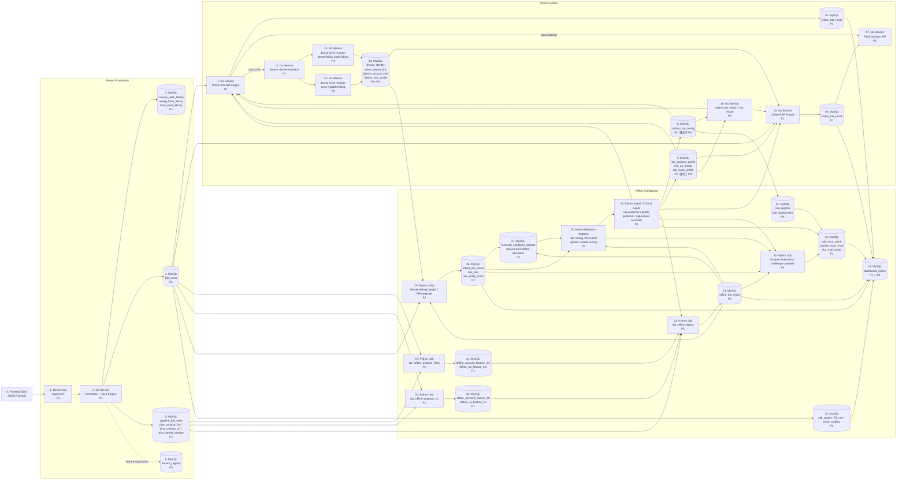

# 工程化系统蓝图

## 核心设计原则

1. 系统由三层构成：`Shared Foundation`、`Online System`、`Offline Intelligence`。
2. `Anti-Bot` 是第一阶段门禁，只有通过 `Anti-Bot` 的流量才进入 `device-id / RBA`。
3. `device-id v1` 是 P1 的在线基线能力，`device-id v2` 是 P2 的在线升级能力，`v1` 保留作为 fallback / baseline。
4. `Offline` 的核心价值不是只做分析，而是持续产出更好的 rule / profile / model intelligence，动态更新 `Online`。
5. `Research Validation Dataset` 主要从 `offline decision` 结果中派生。
6. `Agent / Control Layer` 是 P3 的核心控制中枢，负责同时更新 online execution 和 offline eval / research。

---

